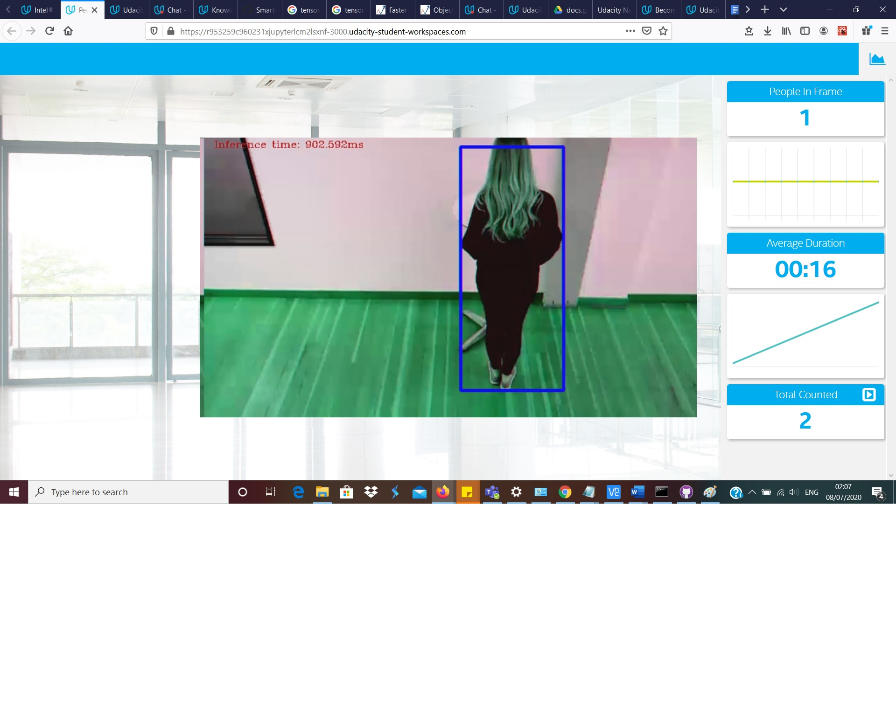

# Project Write-Up

## Explaining Custom Layers
Custom layers are layers not included in the list of known layers.
The process behind converting custom layers involves adding an extension for both the model optimizer and inference engine for the specific device being used eg CPU, GPU or Myriad

## Comparing Model Performance

I compared the models in terms of size before and after conversion to IR.I also compare the models in terms of accuracy and inference speed.

Model|Size before|Size after conversion|Accuracy|Inference time before(run on pc)|Inference time after
---------|----------|------|------|-------|--------|
Faster_rcnn| 55Mb| 52Mb| 85%|9.4667|907ms
ssd_mobile_net| 68Mb| 33Mb| 21% |6.493|70ms
ssd_inception_v2|99.5Mb|95.4Mb|28%|8.044|157ms
person-detection-retail-0002| | |90%| |47ms

## Assess Model Use Cases

This model can be used for the following use cases:
1. Analysing the average speed it takes tellers to serve customers at a banking hall
2.To monitor the use of shared resources and analyse how much time it takes a user on average.
3.To analyse traffic flowing through a business eg a shop or chemist

These use cases would be useful because it would save labour costs as a single camera can perfome work that previously needed many people. The efficiency and accuracy is also higher than when a human does it.

## Assess Effects on End User Needs

Lighting can affect the performance of such a model as it reduces accuracy. 
Accuracy. The models accuracy can be fine tuned by altering the confidence threshold so as to reduce the false positives. The model also waits for 3 seconds after a person has left the frame before counsidering the person as completely left the frame. This helps reduce flikering effect.
Focal length/image size. The input from the camera needs to be resized according to how the model was trained before loading into the model. The focal length also needs to be put into consideration before training the model as it may affect accuracy. ie, people that are far away may be difficult to detect 

## Model Research

Below is the process i followed to get my model of choice

- Model 1: Faster rcnn model
 I sourced the model from the tensorflow model zoo https://github.com/tensorflow/models/blob/master/research/object_detection/g3doc/detection_model_zoo.md
 
 
 I downloaded the model using the below command
 `wget http://download.tensorflow.org/models/object_detection/faster_rcnn_inception_v2_coco_2018_01_28.tar.gz`
 
 I extracted the model using the below command
 `tar -xvf faster_rcnn_inception_v2_coco_2018_01_28.tar.gz`
  
 I changed directory using
  
 cd faster_rcnn_inception_v2_coco_2018_01_28
  
 I then converted the model with the below command to IR format
  
  `python /opt/intel/openvino/deployment_tools/model_optimizer/mo.py --input_model faster_rcnn_inception_v2_coco_2018_01_28/frozen_inference_graph.pb --tensorflow_object_detection_api_pipeline_config pipeline.config --reverse_input_channels --tensorflow_use_custom_operations_config /opt/intel/openvino/deployment_tools/model_optimizer/extensions/front/tf/faster_rcnn_support.json`
  
  - The model was insufficient

- Model 2 ssd_mobilenet
 This is te process i followed to prepare the model
 I downloaded it using the below code
    
  `wget http://download.tensorflow.org/models/object_detection/ssd_mobilenet_v2_coco_2018_03_29.tar.gz`
    
I extracted the model using
`tar -xvf ssd_mobilenet_v2_coco_2018_03_29.tar.gz`

I changed directories

-I then converted it to IR using

`python "C:\Program Files (x86)"\IntelSWTools\openvino\deployment_tools\model_optimizer\mo_tf.py --input_model frozen_inference_graph.pb --tensorflow_use_custom_operations_config "C:\Program Files (x86)"\IntelSWTools\openvino\deployment_tools\model_optimizer\extensions\front\tf\ssd_v2_support.json --tensorflow_object_detection_api_pipeline_config pipeline.config --data_type FP16 --generate_deprecated_IR_V7

- Model was insufficient

- Model 3 ssd_inception_v2

-I acquired the model from the tensorflow modelzoo using the below command
`wget http://download.tensorflow.org/models/object_detection/ssd_inception_v2_coco_2018_01_28.tar.gz`
-I ran the below code from the :

- Model was insufficient

- Model 4 person-detection-retail-00

./downloader.py person-detection-retail-0002

This model performed very well in terms of inference speed and accuracy. I selected this as my main model.

#Deployment on Raspberry pi
I was able to deploy the model on a rasberry pi with a Neural Compute stick 2.
The faster_rcnn model was very slow on the pi with a FPS of 1.35 while the ssd_mobilenet had a FPS OF 10 but underperformed in terms of accuracy.
With this in mind, I used the person-detection-retail-0002 which performed very well and detected all the people in the frame after the false negatives had been dealt with.

I improved the accuracy of mobile_ssd model by inlcuding a waiting time of 3 seconds before a person is declared completely out of the frame and a 1 second delay while people enter the frame.
This helped to counter false positives and false negatives.
The person-detection-retail model also performed very well on the NCS2 and raspberry pi.

  
  
#Screenshots

